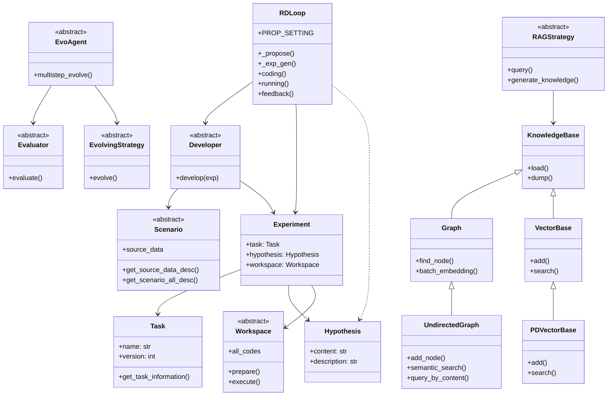
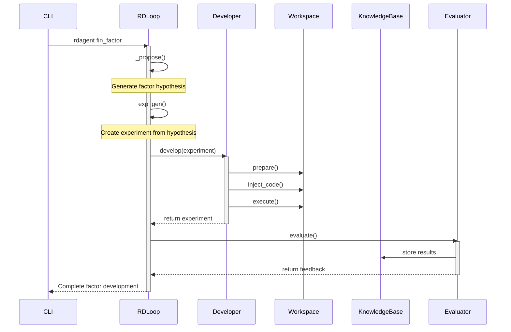
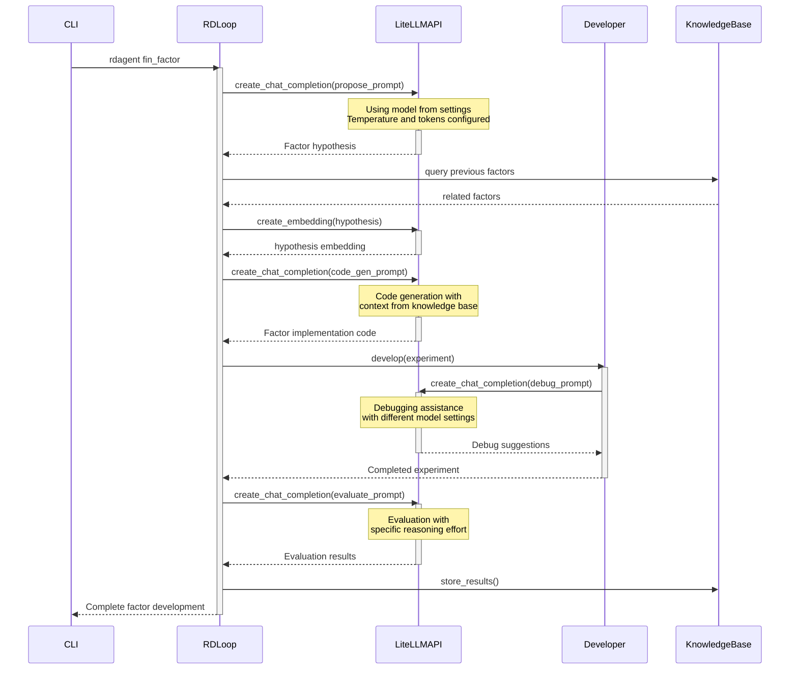

# RD-Agent Design

## Architecture

## Scenario Sequence

## Use of LiteLLM

The sequence diagram shows how LiteLLM integrates with the factor development process:

1. Initial Hypothesis Generation:
   - Uses chat model with controlled temperature for creative yet focused proposals
   - Prompts include previous research context and requirements

2. Code Generation:
   - Higher token limit for complex code generation
   - Prompts include knowledge base context and specific factor requirements
   - Uses JSON mode for structured output when needed

3. Debugging Support:
   - Different model configuration for debugging (specified in chat_model_map)
   - Focused temperature settings for precise problem-solving

4. Evaluation Phase:
   - Uses specific reasoning_effort setting for thorough analysis
   - Structured prompts for consistent evaluation criteria

Throughout the process, LiteLLM handles:
- Token counting and cost tracking
- Model-specific configurations
- Streaming responses for real-time feedback
- Embedding generation for knowledge base integration
