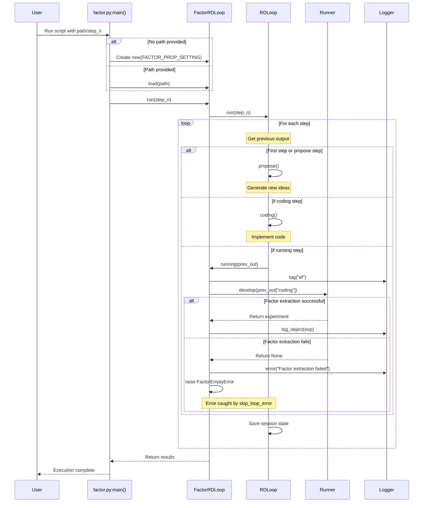

# Factor Workflow Sequence Diagram

The following diagram illustrates the sequence of operations triggered by the factor.py script in the RD-Agent system.

This diagram shows the full lifecycle of a factor development iteration, including:
1. Script initialization with optional loading of existing sessions
2. Execution of the R&D loop
3. The specific implementation of the `running()` method in FactorRDLoop
4. Error handling for factor extraction failures
5. Session persistence between iterations
